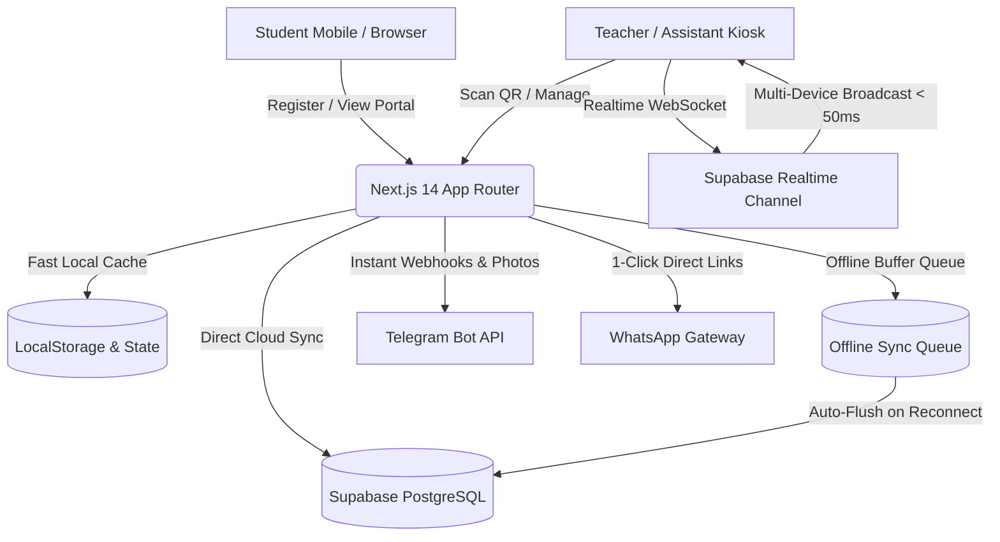

# 🌸 منصة أكاديمية مس نشوى - مادة العلوم المتكاملة (الصف الأول الثانوي)
> **دليل البنية الهندسية وتدفق العمليات والتشغيل السحابي المتكامل (Technical Architecture, Data Flows & Cloud Operations Manual)**

---

## 📑 فهرس المحتويات
1. [🌟 نبذة عن المشروع والقيمة التشغيلية](#-نبذة-عن-المشروع-والقيمة-التشغيلية)
2. [🏗️ المعمارية الهندسية ومكدس التقنيات (Tech Stack & Architecture)](#️-المعمارية-الهندسية-ومكدس-التقنيات)
3. [🔄 تدفق البيانات ودورات حياة العمليات (End-to-End System Workflows)](#-تدفق-البيانات-ودورات-حياة-العمليات)
   - [1. دورة تسجيل وقبول الطالب (Student Onboarding)](#1-دورة-تسجيل-وقبول-الطالب)
   - [2. دورة كشك السكانر وتسجيل الحضور (Scanner Kiosk & Attendance)](#2-دورة-كشك-السكانر-وتسجيل-الحضور)
   - [3. دورة الاشتراكات والتحصيل المالي (Subscriptions & Billing)](#3-دورة-الاشتراكات-والتحصيل-المالي)
   - [4. دورة الامتحانات والتقارير الشهرية الفاخرة (Exams & Report Cards)](#4-دورة-الامتحانات-والتقارير-الشهرية)
   - [5. بوابة الطالب الذاتية (Student Self-Service Portal)](#5-بوابة-الطالب-الذاتية)
   - [6. محرك بوت التليجرام السحابي (Telegram Cloud Webhook)](#6-محرك-بوت-التليجرام-السحابي)
4. [📂 الهيكل البرمجي وخريطة الملفات (Project Structure & Code Map)](#-الهيكل-البرمجي-وخريطة-الملفات)
5. [📶 نظام المزامنة الأوفلاين وطابور الطوارئ (Offline Queue & Sync Engine)](#-نظام-المزامنة-الأوفلاين-وطابور-الطوارئ)
6. [🔐 الأمان وبوابة الرقم السري وعزل البيانات (Security & Passcode Gate)](#-الأمان-وبوابة-الرقم-السري-وعزل-البيانات)
7. [⚙️ دليل الإعداد والتشغيل والنشر السحابي (Setup & Deployment Guide)](#️-دليل-الإعداد-والتشغيل-والنشر-السحابي)

---

## 🌟 نبذة عن المشروع والقيمة التشغيلية

**منصة أكاديمية مس نشوى** هي منصة ويب سحابية متقدمة من الجيل الثالث (PWA / Cloud Native)، صُممت خصيصاً لأتمتة كافة العمليات الإدارية والتعليمية لمجموعات دروس مادة "العلوم المتكاملة" لطلاب المرحلة الثانوية.

### ما الذي تحققه المنصة عملياً؟
1. **القضاء التام على السجلات الورقية**: استبدال كشوف المناداة التقليدية بمسح كروت الطلاب الضوئية (QR Code / Barcode) في أجزاء من الثانية.
2. **الربط المالي اللحظي بالحضور**: كشف فوري لحالة سداد الاشتراك الشهري للطالب بمجرد وقوفه أمام السكانر، مما يمنع الحضور بدون سداد دون إحراج.
3. **التواصل التلقائي الفوري مع أولياء الأمور**: إرسال تقارير الحضور، الغياب، درجات الامتحانات، وشهادات التقييم الشهرية عبر رسائل واتساب مهيأة مسبقاً وتنبيهات تليجرام لحظية للمعلمة.
4. **العمل بدون إنترنت (Offline-First)**: استمرار تسجيل الحضور ومسح الكروت بكفاءة 100% حتى لو انقطع اتصال الإنترنت في السنتر، مع رفع تلقائي فوري للسحابة بمجرد عودة الاتصال.
5. **بوابة رقمية تفاعلية لكل طالب**: بطاقة هوية ثلاثية الأبعاد تفاعلية (Apple Wallet Style)، ومتابعة ذاتية لمعدل الحضور والدرجات وتحميل شهادات التقدير.

---

## 🏗️ المعمارية الهندسية ومكدس التقنيات

تم بناء المنصة وفق نمط المعمارية الهجينة الحديثة (**Hybrid Cloud-Local Architecture**) لضمان سرعة استجابة فائقة (< 1ms) مع موثوقية السحابة:



### المكونات والتقنيات الأساسية:
- **إطار العمل (Core Framework)**: `Next.js 14` (App Router) المبني على `React 18` و `TypeScript` لضمان قوة الأنواع وخلو الشفرة من الأخطاء البرمجية.
- **التصميم وتجربة المستخدم**: `Tailwind CSS` مع نظام الزجاج السائل (`Liquid Glassmorphism`) ودعم الوضع الليلي والنهاري التلقائي ومتجاوب مع جميع أحجام الشاشات.
- **قاعدة البيانات السحابية (Cloud DB)**: `Supabase PostgreSQL` مع سياسات أمان مشددة (`Row Level Security - RLS`) ودوال ذرية لتوليد الأكواد (`Atomic Postgres Functions`).
- **محرك الرسوم والشهادات (Canvas 2D Engine)**: محرك رسومي مدمج فائق الدقة مبني على `HTML5 Canvas 2D` لتوليد كروت الطلاب وشهادات التقارير الشهرية (900x1350px HD) بنصوص عربية صحيحة 100% وخاتم الأكاديمية الرسمي دون الحاجة إلى مكتبات خارجية ثقيلة.
- **محرك المؤثرات الصوتية (Web Audio API)**: توليد نغمات النجاح والتنبيه ديناميكياً عبر المذبذبات الصوتية (`OscillatorNode`) لتوفير استجابة فورية بدون استهلاك بيانات أو انتظار تحميل ملفات MP3.
- **المزامنة متعددة الأجهزة (Multi-Device Sync)**: دمج قنوات `Supabase Realtime WebSockets` مع `BroadcastChannel API` لمزامنة كشك الموبايل مع لابتوب السكرتيرة في زمن استجابة أقل من 50 ملي ثانية.

---

## 🔄 تدفق البيانات ودورات حياة العمليات

---

### 1. دورة تسجيل وقبول الطالب (Student Onboarding)

```
[ولي الأمر / الطالب] 
       │
       ▼ (1) يملأ استمارة التسجيل عبر `/register` (الاسم، الهواتف، المجموعة، رفع الصورة الشخصية)
       │
       ▼ (2) إرسال إشعار فوري وصورة الطالب إلى بوت تليجرام مس نشوى عبر `/api/telegram`
       │
       ▼ (3) تظهر المعاملة كـ "معلقة (PENDING)" في لوحة تحكم المعلمة
       │
       ▼ (4) الموافقة على الطالب ──> يتم توليد كود ذري متسلسل فريد (101, 102, 103...) عبر السحابة
       │
       ▼ (5) توليد كارت الطالب الرقمي ثلاثي الأبعاد والباركود المشفر و QR Code تلقائياً
```

- **مسار الكود**: `src/app/register/page.tsx` ──> `src/lib/storage.ts (registerStudent)` ──> `src/app/api/telegram/route.ts`.
- **أداة اختيار تاريخ الميلاد**: بكرة رقمية تفاعلية تحاكي تجربة نظام iOS الدوارة لحساب العمر بدقة بدون أخطاء كتابية.
- **معالجة الصور**: يتم ضغط الصورة الشخصية في المتصفح عبر Canvas لتقليل حجمها قبل إرسالها إلى التليجرام وقاعدة البيانات.

---

### 2. دورة كشك السكانر وتسجيل الحضور (Scanner Kiosk & Attendance)

```
[الطالب يمرر الكارت أمام الكاميرا / قارئ الليزر]
       │
       ▼ (1) قراءة الرمز وفك التشفير عبر `html5-qrcode` أو `Laser HID Listener`
       │
       ▼ (2) فحص الحالات المنطقية الأربع:
             ├─ حالة 1: طالب نشط ومسدد للاشتراك ──> [صوت نجاح 🎵 + شاشة خضراء + حفظ حضور]
             ├─ حالة 2: طالب نشط وغير مسدد للاشتراك ──> [صوت تنبيه ⚠️ + شاشة برتقالية + حفظ حضور]
             ├─ حالة 3: مسجل بالفعل في هذه الحصة ──> [صوت معلومة ℹ️ + شاشة زرقاء تنبه للتكرار]
             └─ حالة 4: طالب في مجموعة أخرى ──> [طلب تأكيد حضور تعويض (Makeup Session)]
       │
       ▼ (3) تسجيل الحضور فوراً في الذاكرة المحلية (< 1ms) ثم رفع السجل إلى Supabase
       │
       ▼ (4) بث الحدث عبر Realtime ليتحدث جدول لابتوب السكرتيرة دون الحاجة لتحديث الصفحة
```

- **مسار الكود**: `src/app/dashboard/scanner/page.tsx` ──> `src/lib/storage.ts (scanAttendance)`.
- **مانع القفل (Screen Wake Lock)**: الكشك يبقي شاشة الهاتف أو التابلت مضاءة باستمرار لمنع انطفاء الشاشة أثناء دخول الطلاب.
- **تصفير الجلسة**: إمكانية إعادة تعيين كشف الحضور للحصة بضغطة زر عند الرغبة في بدء تجربة جديدة.

---

### 3. دورة الاشتراكات والتحصيل المالي (Subscriptions & Billing)

```
[لوحة الاشتراكات `/dashboard/subscriptions`]
       │
       ▼ (1) احتساب الدورة الشهرية الحالية ديناميكياً عبر `getCurrentMonthLabel()`
       │
       ▼ (2) تبديل حالة الدفع بنقرة واحدة (Toggle Paid / Unpaid) مع توثيق اسم المستلم وتاريخ الدفع
       │
       ▼ (3) توليد إيصال واتساب رسمي بنقرة واحدة موجه لولي الأمر يتضمن تفاصيل الاشتراك
       │
       ▼ (4) تحديث فوري لإحصائيات الإيرادات المحصلة والمتبقية ونسبة السداد العامة
```

- **مسار الكود**: `src/app/dashboard/subscriptions/page.tsx` ──> `src/lib/storage.ts (toggleSubscription)`.
- **المرونة**: في حال تحصيل الاشتراك مباشرة من شاشة كشك السكانر أثناء الدخول، يتم تعديل حالة الدفع وبثها لجميع الشاشات في نفس اللحظة.

---

### 4. دورة الامتحانات والتقارير الشهرية (Exams & Report Cards)

```
[إنشاء ورصد درجات الامتحان] 
       │
       ▼ (1) إضافة اختبار جديد باسم وتاريخ ودرجة عظمى محددة
       │
       ▼ (2) إدخال درجات الطلاب مع التنقل السريع بلوحة المفاتيح
       │
       ▼ (3) إرسال نتائج الاختبار الفردية لولي الأمر عبر واتساب
       │
       ▼ (4) توليد "شهادة التقرير الشهري الشامل" (Monthly Report Card HD)
             ├─ ترويسة الأكاديمية واللوجو وبيانات الطالب وصورته
             ├─ شريط إحصائيات: (نسبة الحضور % - المعدل الأكاديمي والتقدير - حالة الاشتراك)
             ├─ جدول تفصيلي بكافة امتحانات الشهر ودرجاتها
             └─ نصيحة وتوصية المعلمة لولي الأمر + الختم الرسمي الذهبي المعتمد
       │
       ▼ (5) إرسال الشهادة لولي الأمر عبر واتساب أو تنزيلها HD أو طباعتها PDF
```

- **مسار الكود**: `src/lib/generateReportCard.ts` ──> `src/app/dashboard/students/page.tsx` ──> `src/app/student/page.tsx`.

---

### 5. بوابة الطالب الذاتية (Student Self-Service Portal)

- **الرابط**: `/student`.
- **طريقة الدخول**: عبر كود الطالب ورقم الهاتف (أو الدخول المباشر برابط مخصص).
- **الإمكانيات المتاحة للطالب**:
  1. **البطاقة الرقمية**: كارت مجسم 3D تفاعلي يدور مع حركة اللمس، يحتوي على كود الـ QR والباركود لتحضيره في السنتر من شاشة الهاتف.
  2. **سجل الحضور**: جدول بجميع الحصص المحضورة والتعويضية والغياب.
  3. **كشف الدرجات**: سجل كافة الامتحانات السابقة مع التقديرات والملاحظات.
  4. **التقرير الشهري**: معاينة وتنزيل شهادة التقييم الشهرية الصادرة من الأكاديمية.
  5. **تعديل البيانات**: إمكانية تعديل رقم الهاتف أو العنوان أو الصورة الشخصية، مع إرسال إشعار فوري للمعلمة على التليجرام.

---

### 6. محرك بوت التليجرام السحابي (Telegram Cloud Webhook)

- **نقطة النهاية (Endpoint)**: `/api/telegram`.
- **أهم الأوامر المدعومة**:
  - `/stats`: تقرير إحصائي حي (إجمالي الطلاب، الحضور اليوم، المشتركين، المعلقين).
  - `/today`: كشف بأسماء وأكواد الطلاب الذين سجلوا حضورهم اليوم.
  - `/absent`: قائمة بأسماء الطلاب الغائبين عن حصة اليوم مع روابط واتساب لأولياء أمورهم.
  - `/scan <code>`: مسح كود طالب يدوياً عبر الشات وتسجيل حضوره فوراً.
  - **أزرار القبول والرفض الفورية**: إشعار التسجيل الجديد يحتوي على صورة الطالب وزري `[✅ قبول الطالب]` و `[❌ رفض]` لتفعيله بلمسة واحدة من داخل تليجرام.

---

## 📂 الهيكل البرمجي وخريطة الملفات

```
nashwa-academy/
├── src/
│   ├── app/                                # مسارات Next.js App Router
│   │   ├── api/
│   │   │   └── telegram/route.ts           # Webhook معالجة أوامر وتنبيهات بوت التليجرام
│   │   ├── dashboard/                      # لوحة تحكم المعلمة والإدارة
│   │   │   ├── attendance/page.tsx         # سجل الحضور والغياب وكشوفات المجموعات
│   │   │   ├── exams/page.tsx              # إدارة الامتحانات ورصد الدرجات
│   │   │   ├── print-cards/page.tsx        # محرك طباعة كروت الطلاب A4
│   │   │   ├── scanner/page.tsx            # كشك السكانر الفائق وقارئ الباركود ومؤشر الأوفلاين
│   │   │   ├── settings/page.tsx           # إعدادات النظام وتغيير الباسورد والنسخ الاحتياطي
│   │   │   ├── students/page.tsx           # دليل الطلاب والملفات الشخصية والشهادات
│   │   │   ├── subscriptions/page.tsx      # التحصيل المالي والاشتراكات الشهرية
│   │   │   ├── layout.tsx                  # الحماية ببوابة الرقم السري والشريط الجانبي
│   │   │   └── page.tsx                    # الداشبورد الرئيسية والإحصائيات الحية
│   │   ├── register/page.tsx               # استمارة تسجيل الطلاب الجدد وبكرة الميلاد
│   │   ├── student/page.tsx                # بوابة الطالب وكارت الـ 3D والتقرير الشهري
│   │   ├── globals.css                     # إعدادات التصميم الزجاجي والأنيميشن
│   │   ├── layout.tsx                      # الغلاف الجذري وتكوين خط Cairo و PWA
│   │   └── page.tsx                        # الصفحة الرئيسية والتحويل الذكي
│   ├── components/
│   │   ├── AdminPasscodeGate.tsx           # بوابة الرقم السري وحماية الداشبورد ولوحة المفاتيح
│   │   ├── DynamicDatePickerWheel.tsx      # بكرة اختيار تاريخ الميلاد التفاعلية
│   │   └── Navbar.tsx                      # شريط التنقل العلوي
│   ├── lib/
│   │   ├── audio.ts                        # محرك المؤثرات الصوتية Web Audio API
│   │   ├── generateCardImage.ts            # محرك توليد صور كروت الطلاب الرقمية Canvas 2D
│   │   ├── generateReportCard.ts           # محرك توليد شهادات التقارير الشهرية HD Canvas 2D
│   │   ├── storage.ts                      # محرك إدارة البيانات السحابية والمزامنة الأوفلاين
│   │   ├── supabase.ts                     # عميل الاتصال بقاعدة بيانات Supabase
│   │   ├── validation.ts                   # التحقق من أمان وصحة البيانات والنسخ الاحتياطية
│   │   └── whatsapp.ts                     # مولد روابط رسائل الواتساب المجهزة
│   └── types/index.ts                      # تعريفات وهياكل النماذج البرمجية (TypeScript Types)
├── supabase/
│   └── schema.sql                          # مخطط قاعدة البيانات وسياسات RLS والدوال الذرية
├── public/
│   ├── manifest.json                       # ملف تعريف تطبيق الويب التقدمي PWA
│   └── sw.js                               # مشغل Service Worker للتخزين المؤقت
├── README.md                               # الدليل الفني والهندسي للمشروع
└── package.json                            # الاعتماديات وحزم التشغيل
```

---

## 📶 نظام المزامنة الأوفلاين وطابور الطوارئ

تم تجهيز النظام ليعمل في أسوأ ظروف الاتصال بالإنترنت داخل السناتر التعليمية:

```
[انقطاع الإنترنت أثناء الحصة]
       │
       ▼ (1) يرصد النظام انقطاع الشبكة فوراً ويتحول إلى وضع "الأوفلاين 💾"
       │
       ▼ (2) يتم حفظ عمليات الحضور في طابور `OfflineSyncQueue` محلياً
       │
       ▼ (3) يظهر عداد المعاملات المعلقة في أعلى الشاشة (مثلاً: "5 حضور معلق")
       │
       ▼ (4) فور عودة إشارة الإنترنت ──> يتم تفريغ الطابور تلقائياً ورفع البيانات للسحابة
       │
       ▼ (5) إطلاق نغمة تأكيد وعرض إشعار بنجاح المزامنة التلقائية
```

---

## 🔐 الأمان وبوابة الرقم السري وعزل البيانات

1. **عزل كامل لبوابة الطالب**: المسار `/student` معزول بالكامل ولا يحتوي على أي روابط أو منافذ تقود إلى لوحة التحكم الإدارية.
2. **بوابة الرقم السري (`AdminPasscodeGate`)**: تغلف كافة مسارات الداشبورد `/dashboard/*`، وتدعم أي رمز مخصص متغير الطول (مثل `456` أو `2026`).
3. **لوحة مفاتيح رقمية لمسية**: تتيح للمعلمة إدخال الرمز السري بسهولة من الهاتف أو شاشات اللمس مع إمكانية استخدام زر `Enter`.
4. **تأمين مسح وفرمطة البيانات**: زر تصفير البيانات وإعادة التهيئة محمي بالرقم السري لمنع أي مسح غير مقصود للبيانات.
5. **سياسات أمان قاعدة البيانات (RLS)**: جداول Supabase محمية بسياسات صارمة تمنع التعديل غير المصرح به.

---

## ⚙️ دليل الإعداد والتشغيل والنشر السحابي

### 1. المتطلبات الأساسية:
- بيئة تشغيل `Node.js 18+` أو `20+`.
- حساب سحابي على `Supabase` (مجاني).
- بوت تليجرام من `BotFather`.
- حساب على منصة `Vercel` للاستضافة.

### 2. متغيرات البيئة (`.env.local`):
```env
NEXT_PUBLIC_SUPABASE_URL=https://xxxxxxxxxxxx.supabase.co
NEXT_PUBLIC_SUPABASE_ANON_KEY=eyJhbGciOiJIUzI1NiIsInR5cCI6IkpXVCJ9...
TELEGRAM_BOT_TOKEN=8897471175:AAH__IM1R9Ro2yYdClmtZ_X4TvzFZsr5uUs
TELEGRAM_ADMIN_CHAT_ID=6602868710
NEXT_PUBLIC_TELEGRAM_BOT_TOKEN=8897471175:AAH__IM1R9Ro2yYdClmtZ_X4TvzFZsr5uUs
NEXT_PUBLIC_TELEGRAM_ADMIN_CHAT_ID=6602868710
TELEGRAM_WEBHOOK_SECRET=nashwa_secret_webhook_token_2026
```

### 3. إعداد قاعدة البيانات:
قم بفتح **SQL Editor** في لوحة تحكم مشروعك على Supabase والصق محتويات الملف `supabase/schema.sql` ثم اضغط **Run** لإنشاء:
- الجداول: `students`, `groups`, `sessions`, `attendance`, `subscriptions`, `exams`, `exam_results`, `system_settings`.
- الدالة الذرية: `get_next_student_code()`.

### 4. التشغيل المحلي:
```bash
# تثبيت الحزم
npm install

# تشغيل خادم التطوير
npm run dev

# بناء نسخة الإنتاج وفحص الأنواع
npm run build
```

### 5. النشر السحابي على Vercel:
```bash
npx vercel --prod
```

---

<div align="center">
  <b>🌸 منصة أكاديمية مس نشوى - هندسة برمجية متكاملة لخدمة التعليم الحديث 🌸</b>
  <br>
  <span>الرابط المباشر للإنتاج: <a href="https://nashwa-academy.vercel.app">https://nashwa-academy.vercel.app</a></span>
</div>
